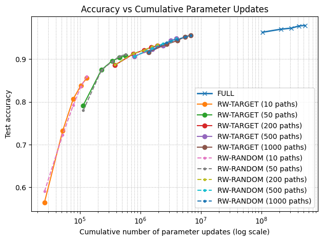

# Random-Walk Sparse Backpropagation on MNIST

This repo contains an experiment exploring **sparse gradient updates** using
random walks through a feedforward neural network trained on MNIST.

Instead of updating all weights via standard backpropagation, we:

1. Compute the forward pass to get logits
2. Compute loss with cross-entropy
3. Compute **full dense gradients** using `loss.backward()`
4. Perform biased random walks backward from output neurons through the network
5. Construct a **sparse mask** from the walked connections
6. Apply the mask to gradients (zeroing everything else)
7. Update **only the selected weights** with the optimizer

This effectively turns dense backprop into a **sparse gradient update rule** controlled
by a single hyperparameter: `num_paths_per_batch`.

---

## Methods

We compare three training modes on a simple MLP for MNIST:

- **FULL**: standard backpropagation (all gradients used)
- **RW-RANDOM**: random walks starting from random output neurons
- **RW-TARGET**: random walks starting from the true output class in the batch

For each mode and number of paths (10, 50, 200, 500, 1000), we track:

- Test accuracy
- Gradient density (fraction of parameters updated per batch)
- Cumulative number of parameter-update operations across training

---

## Key Result (MNIST)

Sparse random-walk training **consistently learns** and approaches full backprop performance
while updating only a tiny fraction of weights per batch.

Example:

- With **1000 random walk paths per batch** (≈ **1.2%** of parameters updated per batch),
  `RW-TARGET` and `RW-RANDOM` reach **~95–96% test accuracy**.
- Full backprop reaches ~97–98% accuracy, but requires **~80–100× more parameter updates**
  across training.

This shows that **sparse gradient updates chosen by random walks can be an effective
approximation to full backpropagation**.

---

## Running the code

Clone the repo and install dependencies:

```bash
git clone https://github.com/RyanEAA/random-walk-sparse-backprop.git
cd random-walk-sparse-backprop

python3 -m venv .venv
source .venv/bin/activate

pip install -r requirements.txt
```

run Jupyter Notebook

---

## Definitions

**Density** = the mean fraction of trainable parameters receiving non-zero gradients after masking.

---

## Prelim Results

Model: 3-layer MLP with ReLU activations  
Dimensions: 784 → 256 → 128 → 10

| Method | Epochs | Fraction of Parameters Updated per Epoch (%) | Test Accuracy |
| -------------------------- | ------ | ------------------: | ------------: |
| **Full Backprop**          | 5      |               100.0 |        ~97.5% |
| **RW-Target (10 paths)**   | 5      |               0.023 |          ~86% |
| **RW-Target (50 paths)**   | 5      |                0.10 |          ~90% |
| **RW-Target (200 paths)**  | 5      |                0.35 |          ~92% |
| **RW-Target (500 paths)**  | 5      |                0.70 |          ~94% |
| **RW-Target (1000 paths)** | 5      |                1.20 |        ~95.6% |



## TODO (Dec–Jan)

- [ ] CIFAR-10 experiments (CNN)
- [ ] Fashion-MNIST experiments
- [ ] Fine-tuning dense → sparse transition
- [ ] Random-walk path parallelization
- [ ] Literature review summary


## Related Work

For sparse gradient masking approaches, see:

- Frankle & Carbin (2019), Lottery Ticket Hypothesis  
- Evci et al. (2020), RigL  
- Mohtashami (2022), Masked Training of Neural Networks with Partial Gradients  
- Jaiswal (2022), Training Your Sparse Neural Network Better with Any Mask


